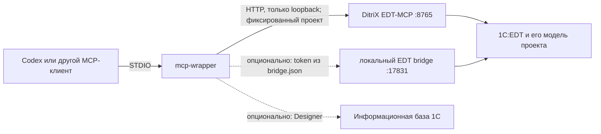

# 1C:EDT MCP Toolkit

Версия 0.7.0 добавляет функции средней сложности: `get_object_help`, единый `launch_debugger`, `code_review` через BSL Language Server, `manage_infobase` и безопасный фасад `edit_metadata` для форм, расширений и СКД. Подробности и примеры: [TOOLS_0_7.md](docs/TOOLS_0_7.md).

Версия 0.6.0 добавляет совместимый слой для повседневной разработки: список проектов EDT, агрегаторы контекста и поиска, безопасное редактирование BSL, единый экспорт EPF/ERF/CF/CFE и ограниченные Git-операции. Полное описание: [TOOLS_0_6.md](docs/TOOLS_0_6.md).

Набор исходников для безопасной работы MCP-клиента с проектами конфигураций 1С в EDT и информационными базами 1С.

Проверенная связка: Windows 11, 1C:EDT 2025.2.6.4, DitriX EDT-MCP 2.8.1, платформа 1С 8.3.27, Go 1.25 и Java 17.

## Что находится в репозитории

| Каталог | Назначение | Лицензия |
|---|---|---|
| `mcp-wrapper` | STDIO MCP-сервер на Go. Закрепляет доступ за одной базой/EDT-проектом, проксирует DitriX EDT-MCP и добавляет защищённые операции | MIT |
| `edt-bridge` | Опциональный loopback-плагин EDT для доступа к модели метаданных, BSL и управляемым проектам EPF/ERF | EPL-2.0, производная от `1C-Company/dt-example-plugins` |
| `docs` | Установка, настройка, проверка и устранение ошибок | документация проекта |

Сторонний DitriX EDT-MCP не скопирован в репозиторий. Его следует устанавливать из [официального релиза 2.8.1](https://github.com/DitriXNew/EDT-MCP/releases/tag/v2.8.1) на условиях его собственной лицензии.

## Архитектура



Основные ограничения безопасности:

- имя EDT-проекта, база и разрешённые каталоги задаются при запуске сервера и не принимаются от модели произвольно;
- оба HTTP-контура слушают только loopback-интерфейс;
- `bridge.json` содержит одноразовый токен и создаётся только на время работы EDT;
- пароли базы читаются только из переменных `ONEC_DB_USER` и `ONEC_DB_PASSWORD`;
- операции изменения метаданных требуют отдельной подготовки плана и подтверждения;
- в Git не включаются базы, токены, локальные профили, бинарники и журналы.

## Быстрый старт

1. Установите и запустите 1C:EDT, откройте нужный проект и дождитесь завершения построения.
2. Установите DitriX EDT-MCP 2.8.1 по инструкции его релиза.
3. Проверьте в PowerShell:

   ```powershell
   Invoke-RestMethod http://127.0.0.1:8765/health
   ```

   В ответе ожидаются `ready: true` и версия плагина `2.8.1`.

4. Соберите обёртку:

   ```powershell
   Set-Location .\mcp-wrapper
   .\build.ps1
   ```

5. Добавьте MCP-сервер в конфигурацию Codex, заменив пути и имя проекта:

   ```toml
   [mcp_servers.onec_edt]
   command = "C:\\Tools\\1C_MCP\\mcp-wrapper\\dist\\mcp-1c-analog.exe"
   args = [
     "--ditrix-edt-url", "http://127.0.0.1:8765/mcp",
     "--ditrix-project", "ИмяПроектаEDT"
   ]
   startup_timeout_sec = 60
   tool_timeout_sec = 300
   ```

6. Полностью перезапустите Codex, чтобы он перечитал список MCP-инструментов.

Полная пошаговая инструкция, включая опциональный bridge: [INSTALL.md](docs/INSTALL.md). Проверка: [TESTING.md](docs/TESTING.md). Решение проблем: [TROUBLESHOOTING.md](docs/TROUBLESHOOTING.md).

## Лицензии и авторство

См. [LICENSE](LICENSE) и [THIRD_PARTY_NOTICES.md](THIRD_PARTY_NOTICES.md). Права на платформу 1С, EDT и сторонние плагины принадлежат их правообладателям. Репозиторий не содержит их закрытых дистрибутивов или данных информационной базы.
